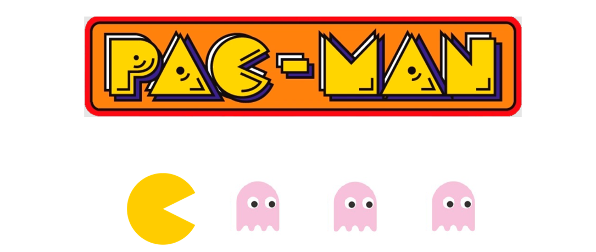

<h1 align="center"> PyPac </h1>


<p align="center"> 
  
</p>


> **Master's degree in Computer Engineering, Cybersecurity and Artificial Intelligence - University of Cagliari**

> **Artificial Intelligence**

> **Authors**: Lello Molinario - Maria Chessa


***
# Table of Contents
1. [Installation](#installation)
2. [Project Goal](#project-goal)
3. [Problem Formulation](#problem-formulation)
4. [Solution Design](#solution-design)
5. [Conclusions](#conclusions)

***

## Installation

- Download the ZIP code or clone the repository with
  ```bash
  git clone https://github.com/lmolinario/PyPac.git
  ```
- Install the requirements with

  ```bash
  pip3 install -r requirements.txt
  ```
- Run the file `PyPac.py` to start the program in its graphical mode with maze animation
- Run alternatively the file `PyPac_non_graphical_mode.py` to start the program in its non-graphical mode without maze animation and speed up the production of results


## Project goal


The proposed project aims at deepening the knowledge of the key concepts and the potential behind graph search through its application to a modified version of Pacman problem. 
According to the revisitation, Pacman's objective is to find the shortest way to reach the end of the maze while eating all the ghosts distributed across it.
To solve the pathfinding problem a practical and modular implementation of the tree-search algorithm is provided in Python, and characterized by the alternation of different search strategies, each evaluated in its effectiveness and efficiency on multiple problem instances.


## Problem formulation


Unlike standard mazes characterized by a predefined start from which only by a unique path is possible to reach a predefined end, the maze where our Pacman moves has a variable start, a set of objective positions corresponding to the points of the maze where the ghosts are placed and progressively leading to a variable end, and more than one path available from the start to the end. 
Its construction starts from a grid, whose cells are identified by pairs of coordinates and initially set up to 1, so that they represent walls not accessible by Pacman. The application of the depth-first backtracking search algorithm enables the random generation of a rectangular maze by progressively selecting some of these cells and setting them to 0, so that they represent accessible positions as part of a walkable path.  
The width and height of the maze, the number of ghosts that inhabit it and the number of alternative paths accessible by Pacman are not fixed: they are either chosen by the user or set up to random default values that vary at each program execution.
Under this configuration, the proposed problem has been faced as a search problem and characterized by the following formulation:
- **Initial State**: any given maze configuration
- **Goal State**: the achievement of a set of desired states, coincident with the intermediate positions in the maze (including the final one leading to the exit of this latter) where the ghosts are placed 
- **Goal test**: a check on whether or not any given state matches the goal state
- **Actions**: Pacman's moves from any given position (grid cell) to an adjacent one
- **Path cost**: stated that the objective is to reach the goal state by the shortest sequence of moves, each action costs 1 move, and the path cost is the number of Pacman's steps in the path

## Solution Design

Formulated as above, the search problem finds its solution in a sequence of actions carried out by Pacman, that from the initial state leads this latter to the goal state describing a path, as a result of a systematic exploration of all possible sequences of actions conveniently represented in a search tree with nodes (states) and edges (actions). This is performed by search strategies, that provide various search algorithms differing in the criterion adopted in the choice of which action sequence to select during the search process to move to the next state. The candidate states from which the algorithms draw on for such choice at end of each action sequence are collected as leaf nodes in an associated structure called frontier, representive of the partial plan to be potentially expanded in graph search.
To solve the Pacman-maze problem we considered the following strategies, divided by category:
- **Uninformed strategies**:
  - No information on the goal state enabling the avoidance of systematic exploration of the search space aimed at problem resolution
    - Depth-First Search (DFS): expands the **deepest** leaf node first
    - Breadth-First Search (BFS): expands the **shallowest** leaf node first
    - Uniform-Cost Search (UCS): expands the leaf node with the **lowest path cost** 
- **Informed strategies**
  - Information on the goal state enabling the identification of the most promising node towards the solution during the search
    - Greedy Best-First Search (GBFS): expands the leaf node with the **lowest heuristic** (estimated cost of the action sequence from the leaf node to the goal)
    - A* Search (ASTAR): expands the leaf node with the **lowest combination of the path cost and the heuristic** (estimated total cost of the action sequence from the root to a goal state through the leaf node itself)
      

All share the same basic steps, incorporating the essence of the general graph search: given a problem instance, the strategy applies its logic to the current state of the problem, starting from the initial one and progressively looping through the frontier to identify the next state, as partial solution to the goal.
As soon as the goal state is reached, the search ends by keeping the information about the path that led to this state, its associated cost, and the strategy's effort while searching that. 


### Search Strategies

The search algorithm embodied by each search strategy is encapsulated and managed differently in the specific Python module `search_strategy.py`.
Despite being characterized by the same base structure, each algorithm has its own class and implementation characterized as follows:
1. **`DFS_Strategy`**:
   - This class implements the Depth-First Search algorithm, whose logic is incorporated by the `get_solution` method 
      - It maintains a stack (`frontier`) where each element is a tuple `(position, path)` representing a state
      - It pops states from the end of the stack and explores each associated successor node in a depth-first manner, progressively updating the current position and path and appending new states into the stack, according to a Last-In-First-Out (LIFO) logic
    
      
2. **`BFS_Strategy`**:
    - This class implements the Breadth-First Search algorithm, whose logic is incorporated by the `get_solution` method 
      - It maintains a queue (`frontier`) where each element is a tuple `(position, path)` representing a state
      - It dequeues states from the front of the queue and explores each associated successor node, updating the current position and path and appending new states into the queue, according to a First-In-First-Out (FIFO) logic

3. **`UCS_Strategy`**:
    - This class implements the Uniform Cost Search algorithm, whose logic is incorporated by the `get_solution` method 
      - It maintains a priority queue (`frontier`) where each element is a tuple `(cost, position, path)` representing a state
      - It pops states with the lowest path cost from the priority queue and explores each associated successor node, updating the current position, path and path cost and pushing new states into the queue 


4. **`GREEDY_Strategy`**:
    - This class implements the Greedy Best-First Search algorithm, whose logic is incorporated by the `get_solution` method 
      - It maintains a priority queue (`frontier`) where each element is a tuple `(heuristic, position, path)` representing a state
      - It pops states with the lowest heuristic value from the priority queue and explores each associated successor node, updating the current position, path and heuristic and pushing new states into the queue

5. **`ASTAR_Strategy`**:
    - This class implements the A* search algorithm, whose logic is incorporated by the `get_solution` method 
      - It maintains a priority queue (`frontier`) where each element is a tuple `(heuristic + cost, cost, position, path)` representing a state
      - It pops the state with the lowest estimated total cost (`heuristic + cost`) from the priority queue, and explores each associated successor node, updating the current position, path, path cost and estimated total cost, and pushing the new states into the queue


While searching for a path from the Pacman initial position to the goal one and properly managing the frontier, each of the above classes keeps track of the visited positions to avoid repeated states and loops, of the traversed path and the expanded nodes, returning them for performance evaluation.
Concerning the implemented informed strategies, the additional `heuristic` method provides a simple admissible heuristic used to estimate the distance between two positions in a grid: the Manhattan distance. 
The Manhattan distance, also known as the taxicab distance or city block distance, is a distance metric based on the calculation of the sum of the absolute difference between the coordinates of two points. In a grid, this amounts to measure the distance that separates one position to another as the sum of the vertical and horizontal distances between the two.
That's exactly what is computed by the mentioned method, in charge of determining the distance between the arguments `first_pos` and `last_pos`, tuples containing pairs of x- and y-axis coordinates respectively respresentitive of the position currently occupied by Pacman and the one it has to potentially reach. 


## Conclusions

- Among all the search strategies, the informed A* search ensures Pacman to find the best path to reach all the ghosts distributed across the maze and leave the same: known to be optimal and optimally efficient by nature, it provides the best trade-off between the path cost and the amount of expanded nodes during the search process, two major performance evaluators for the effectiveness and the efficiency of search algorithms
- Artificial Intelligence (AI) finds its essence in human intelligence, moved by the objective of building machines that behave intelligently and autonomously solve real-world and complex tasks. Graph search is one expression of AI that reflects how human brain could be processing context information to solve a search problem but providing increased efficiency, faster speed, and complexity reduction

